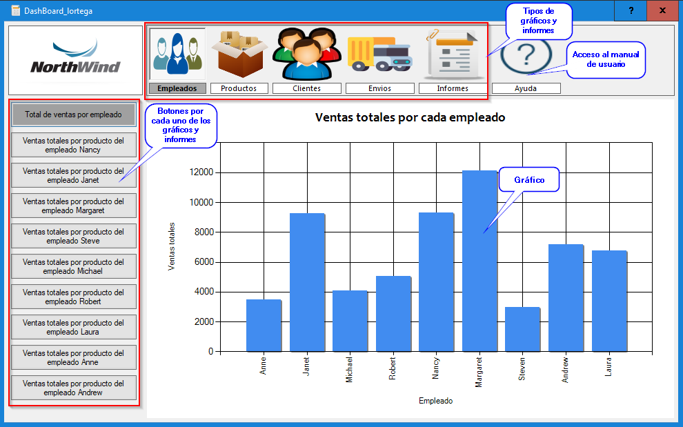
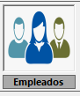
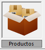
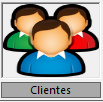
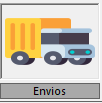
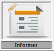

# DI-06
Dashboard Lortega

## Índice

- [About](#About)
- [Contacto](#Contacto)
- [Guía de instalación](#guía-de-instalación)
- [Referencias](#Referencias)

## About
Aplicación para la visualización de gráficos y informes de la empresa NorthWind

### Tipos de gráficos y informes

- Total de ventas por empleado
- Ventas totales por producto del empleado Nancy 
- Ventas totales por producto del empleado Janet 
- Ventas totales por producto del empleado Margaret 
- Ventas totales por producto del empleado Steve 
- Ventas totales por producto del empleado Michael 
- Ventas totales por producto del empleado Robert 
- Ventas totales por producto del empleado Laura 
- Ventas totales por producto del empleado Anne 
- Ventas totales por producto del empleado Andrew

- Productos más vendidos superiores a 1.000 unidades 
- Productos más vendidos superiores a 500 unidades 
- Productos vendidos inferiores a 1.000 unidades 
- Productos vendidos inferiores a 500 unidades 
- Productos con stock menor de 10 
- Productos con stock menor de 20 
- Productos con stock menor de 40 
- Productos con stock menor de 80
- Productos con stock menor de 100

- Ventas por clientes superiores a 10.000 euros 
- Ventas por clientes superiores a 20.000 euros 
- Ventas por clientes superiores a 40.000 euros 
- Ventas por clientes inferiores a 10.000 euros 
- Ventas por clientes inferiores a 5.000 euros 
- Ventas por clientes inferiores a 1.000 euros 
- Ventas por clientes inferiores a 500 euros

- Ventas totales por compania de envío 
- Ventas totales por pais 
- Ventas totales por ciudad

- Ventas Totales Por Categoría y Año 
- Productos Comprados Por un Cliente 
- Ventas Totales por Cada Empleado 
- Ventas Totales por Clientes 
- Stocks de Productos 
- Total de Envios por Pais 

## Contacto
DashBoard

Copyright (C) 2022 lortega

lortega@nortthwind.com

## Guía de instalación

## Referencias
